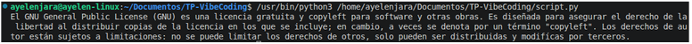

# Informe de Laboratorio: IA Soberana y Vibe Coding

## 1. Arquitectura y Despliegue

### Modelo Elegido
`qwen2.5:0.5b`

### Justificación de Hardware
Se seleccionó el modelo **Qwen 2.5 de 500 millones de parámetros (0.5B)** debido a que es un modelo ultraligero optimizado para ejecutar en CPU y entornos con recursos de memoria RAM muy limitados.

Su tamaño reducido (aproximadamente medio gigabyte) permite obtener respuestas rápidas de la API local sin saturar el rendimiento de la máquina virtual.

### Comandos de Podman Utilizados
Los comandos detallados de despliegue y administración se encuentran documentados de forma completa en el archivo adjunto `infraestructura.md` del repositorio. Sin embargo, los comandos troncales fueron:

```bash
# Despliegue del contenedor de Ollama en segundo plano mapeando el puerto de la API
podman run -d -v ollama:/root/.ollama -p 11434:11434 --name ollama docker.io/ollama/ollama

# Descarga y ejecución en modo interactivo del modelo qwen2.5:0.5b
podman exec -it ollama ollama run qwen2.5:0.5b
```

### Evidencia de la API (Curl)
Al realizar la comprobación de la API local mediante el siguiente comando:

```bash
curl http://localhost:11434/
```

El servidor local respondió de manera exitosa con el mensaje de estado estándar:

```text
Ollama is running
```

---

## 2. Bitácora de Vibe Coding

### Contexto Inicial del Entorno de Trabajo

En primer lugar, se descargó el texto de la Licencia GNU GPLv3, el cual fue almacenado localmente en un archivo de texto llamado `archivo_prueba.txt`.

Todo el flujo de trabajo, incluyendo la escritura del script, la depuración y la ejecución de comandos, se centralizó en el entorno de desarrollo **Visual Studio Code (VS Code)**.

Como herramienta de Inteligencia Artificial para el proceso de *Vibe Coding*, se utilizó la extensión **OpenCode** integrada en el editor.

---

### Registro de Interacción y Resolución de Problemas

#### Iteración 1: Definición del objetivo inicial

**Descripción:** Configuración inicial del script. Se definió el propósito del código, el archivo origen de los datos y el endpoint local de la API de Ollama.

**Vibe Coder:**  
> Necesito que crees un script en Python que lea el contenido del archivo llamado "archivo_prueba.txt" y lo envíe a la API de Ollama que está en http://192.168.1.29:11434/api/generate, con la instrucción de generar un resumen de 3 líneas.

**Asistente IA (OpenCode):**  
> Voy a crear un script en Python que lea un archivo de prueba y envíe su contenido a la API de Ollama para generar un resumen. Primero déjame ver qué hay en tu directorio de trabajo actual. Perfecto, veo que el archivo archivo_prueba.txt ya existe. Voy a crear un script que lea ese contenido y lo envíe a la API de Ollama. *(Alerta de seguridad del sistema: The model wants to edit files outside of your workspace (ollama_summarizer.py). Do you want to allow this?)*

#### Iteración 2: Restricción de entorno y asignación de modelo

**Descripción:** La IA intentó crear archivos nuevos y escribir fuera del directorio de trabajo actual. Además, faltaba especificar el modelo exacto de Ollama.

**Vibe Coder:**  
> Actualiza el código existente exclusivamente dentro de mi archivo script.py, que está en la carpeta TP-VibeCoding. No crees archivos nuevos ni escribas fuera del directorio actual. En el código, reemplaza el texto de relleno por el modelo exacto que vamos a usar en Ollama, que es "qwen2.5:0.5b".

**Asistente IA (OpenCode):**  
> Inicio: crear la lista de tareas y luego abrir script.py para editarlo. Voy a crear una lista de tareas breve para el cambio. Ahora abro script.py para leer su contenido y ver qué cambiar. Ahora escribiré el nuevo contenido en script.py para leer el archivo y llamar a la API de Ollama. Ahora aplico los cambios al archivo script.py: leeré el archivo y añadiré la llamada POST a Ollama usando qwen2.5:0.5b. Actualizo la lista de tareas marcando los pasos de edición como completados. Ahora validaré la sintaxis del script con python -m py_compile.

#### Iteración 3: Control de la salida y parseo JSON

**Descripción:** Al hacer la primera prueba la conexión fue exitosa, pero el script imprimía toda la respuesta en formato JSON crudo por terminal en lugar de mostrar solo el texto generado.

**Vibe Coder:**  
> Actualiza el código en script.py. La conexión fue exitosa, pero el script imprime toda la respuesta JSON cruda. Modifica el código para que analice la respuesta utilizando la librería json e imprima por pantalla únicamente el texto generado, que se encuentra dentro de la clave "response". Sigue usando el modelo 'qwen2.5:0.5b' y no utilices librerías externas.

**Asistente IA (OpenCode):**  
> Perfecto. He actualizado script.py con los siguientes cambios: Simplificada la extracción de JSON para que busque directamente la clave "response" en el diccionario. Elimina el JSON crudo y solo imprime el contenido del campo "response". Sin librerías externas - solo usa módulos builtin de Python. Ahora cuando ejecutes el script, debería imprimir solo el texto del resumen generado por Ollama, sin la respuesta JSON completa.

#### Iteración 4: Configuración del parámetro Stream de la API

**Descripción:** La consola continuaba mostrando bloques de datos JSON fragmentados debido al comportamiento por defecto de la API de Ollama (*streaming* habilitado). Se requirió la desactivación del flujo continuo.

**Vibe Coder:**  
> Sigue imprimiendo la respuesta cruda. Actualiza la función call_ollama y modifica la variable payload agregando "stream": False. No modifiques absolutamente nada más del archivo.

**Asistente IA (OpenCode):**  
> Voy a corregir call_ollama para incluir stream: False y extraer el texto correctamente desde el JSON de Ollama. Solo editaré esa función.

#### Iteración 5: Refinamiento de instrucciones restrictivas

**Descripción:** El script procesó los datos correctamente, pero el modelo local ignoró la restricción de longitud, devolviendo una estructura extensa que incluía introducción, viñetas, conclusión y errores de traducción.

**Vibe Coder:**  
> El código funciona pero el modelo ignora las 3 líneas, usa viñetas y tiene errores de traducción. Modifica sólo la parte del código para que la orden sea más restrictiva. Necesito que resuma el texto en español, en EXACTAMENTE 3 ORACIONES, sin introducciones, conclusiones o viñetas. No modifiques ninguna otra parte del código ni borres los tiempos de espera.

**Asistente IA (OpenCode):**  
> Actualicé el prompt en la función main() para ser más restrictivo. Ahora especifica EXACTAMENTE 3 ORACIONES en español, sin viñetas, introducciones ni conclusiones. El resto del código permanece sin cambios.

#### Iteración 6: Corrección por inversión de orden contextual

**Descripción:** Se produjo una alucinación del modelo que derivó en una respuesta completamente en idioma inglés. Se modificó la ingeniería del prompt, alterando el orden de las variables para ubicar las reglas estrictas al final del flujo de lectura de la IA.

**Vibe Coder:**  
> El modelo se olvidó de las reglas y me respondió un texto largo en inglés. Modifica únicamente la variable prompt para invertir el orden: poné la variable del texto primero, y la instrucción restrictiva al final. La instrucción final debe ser: "Resume el texto anterior en ESPAÑOL usando EXACTAMENTE 3 ORACIONES. No uses viñetas, listas, introducciones ni conclusiones". No modifiques ninguna otra parte del código ni los tiempos de espera.

**Asistente IA (OpenCode):**  
> Actualicé el prompt invirtiendo el orden: el texto va primero, seguido por la instrucción restrictiva final. Sin cambios en el resto del código ni los tiempos de espera.

#### Iteración 7: Ajuste de especificidad del prompt semántico

**Descripción:** El modelo retornó al idioma español, pero persistió en la generación de múltiples párrafos en lugar del formato solicitado.

**Vibe Coder:**  
> El modelo sigue escribiendo 4 párrafos en lugar de 3 oraciones. Modifica la variable prompt para que sea más restrictiva. La instrucción final debe ser: "Escribe un breve resumen del texto anterior de un (1) solo párrafo en ESPAÑOL. Máximo 3 oraciones en total. No uses viñetas, listas, introducciones ni conclusiones". No modifiques ninguna otra parte del código.

**Asistente IA (OpenCode):**  
> Actualizando solo el prompt para ser más restrictivo, sin cambiar nada más del script.

#### Iteración 8: Resolución imperativa mediante lógica de código (Python)

**Descripción:** Debido a las limitaciones del modelo local utilizado, este seguía devolviendo texto de más independientemente del prompt. Se optó por una solución de fuerza bruta: forzar el recorte de las 3 oraciones directamente mediante código Python.

**Vibe Coder:**  
> El modelo sigue devolviendo texto de más. Modifica la función main() para recortar la variable result justo antes del print(result). Separa la cadena de texto usando los puntos (.), quédate únicamente con las primeras 3 oraciones, y vuelve a unirlas asegurándote de que el texto termine con un punto final. No modifiques la función call_ollama ni los tiempos de espera.

**Asistente IA (OpenCode):**  
> Revisando la función main() para añadir el recorte seguro antes de imprimir el resultado. Aplicando el recorte de resultado justo antes de imprimir, manteniendo el código de call_ollama intacto.

---

### Evaluación del Resultado Final

Finalmente se logró obtener un resumen que se ajusta estrictamente a la estructura de las tres líneas solicitadas. Si bien cuenta con algunos errores de redacción y traducción, el resultado representa un rendimiento adecuado para un modelo ultraligero ejecutándose localmente sobre hardware limitado.

A continuación, se adjunta la captura de pantalla del texto final impreso por la terminal:



---

## 3. Conclusión Final

Procesar la información de manera local mediante el despliegue de un LLM propio garantiza una mayor soberanía tecnológica, resguardando la privacidad y confidencialidad de los datos sensibles al evitar que archivos, registros (logs) o código propietario sean enviados a infraestructuras en la nube de terceros; sin embargo, la principal desventaja de este enfoque radica en las limitaciones del hardware doméstico o educativo, lo que obliga a utilizar modelos de lenguaje ultraligeros cuya capacidad de razonamiento, precisión y manejo de contexto suele ser inferior en comparación con servicios comerciales de gran escala. En consecuencia, se establece un equilibrio entre autonomía tecnológica, privacidad y capacidad técnica, donde se sacrifica parte del rendimiento a cambio de un mayor control sobre la información procesada.
